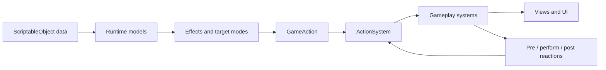

# Slay the Spire Tutorial

A small, data-driven deck-building combat prototype made with Unity. The project is the completed result of a 24-part tutorial and focuses on the architecture of cards, actions, reactions, targeting, perks, and status effects.

> [!IMPORTANT]
> This repository is an educational combat sandbox, not a complete game. It currently contains one playable encounter and no victory, defeat, progression, or save flow.

## Current Features

- Random draw pile, hand, discard pile, and automatic reshuffling
- Mana costs and end-of-turn mana refill
- Manual enemy targeting and automatic target modes
- Composable card effects stored with `SerializeReference`
- Sequential game actions with pre- and post-reactions
- Enemy turns, attacks, damage, death, and simple animations
- Perks that react to game actions
- Armor and burn status effects
- Data-driven heroes, enemies, cards, and perks through `ScriptableObject` assets

## Requirements

| Requirement | Version or location |
|---|---|
| Unity Editor | `6000.4.10f1` |
| Render pipeline | Universal Render Pipeline `17.4.0` |
| Unity Splines | `2.8.4` |
| UI | Unity UI and TextMesh Pro |
| Tweening | DOTween under `Assets/Plugins/Demigiant` |
| Managed-reference inspector | Serialize Reference Editor under `Assets/SREditor` |
| VFX | Cartoon FX Remaster assets under `Assets/JMO Assets` |

## Quick Start

1. Clone the repository.
2. Add the project directory to Unity Hub.
3. Open it with Unity `6000.4.10f1`.
4. Wait for package restoration and asset import to finish.
5. Open `Assets/Slay-the-spire-tutoriel.unity`.
6. Enter Play Mode.

## How to Play

- Hover over a card to display its enlarged preview.
- Drag an automatically targeted card into the blue drop area to play it.
- Press and hold a manually targeted card, aim the arrow at an enemy, and release it.
- A card is only played when enough mana is available.
- Select **End Turn** to discard the hand, resolve enemy burn and attacks, refill mana, and draw a new hand.

The included deck demonstrates five card patterns:

| Card | Pattern |
|---|---|
| Fireball | Manual target plus direct damage |
| Arrow Rain | All-enemy target plus direct damage |
| Draw | No target plus card draw |
| Armor Up | Hero target plus armor |
| Firestorm | All-enemy target plus burn |

The encounter starts with two Slimes, one Red Slime, and the Counterattack perk.

## Architecture at a Glance



The project uses a command-like action pipeline:

1. User input or a system creates a `GameAction`.
2. `ActionSystem.Perform` starts its coroutine flow.
3. PRE subscribers may append reactions.
4. A registered system performer executes the action.
5. Reactions created during the performer are resolved.
6. POST subscribers may append more reactions.
7. The root action completes and interaction is unlocked.

For example, playing a damage card produces this chain:

```text
PlayCardGA
  -> SpendManaGA
  -> PerformEffectGA
  -> DealDamageGA
  -> KillEnemyGA (when health reaches zero)
```

## Project Structure

```text
Assets/
  Data/                   ScriptableObject content assets
  Media/                  Card art, combatant art, icons, and audio
  Prefabs/                Cards, combatants, perks, and status UI
  _Scripts/
    Creators/             Prefab factories
    Data/                 ScriptableObject definitions
    Effects/              Serializable effect descriptions
    GameActions/          Action payloads
    General/ActionSystem/ Action and reaction engine
    Models/               Runtime and polymorphic models
    PerkConditions/       Perk subscription rules
    Systems/              Gameplay orchestration and performers
    TargetModes/          Automatic target selection
    UI/                   UI-specific components
    Views/                Scene representation and input
```

## Core Concepts

### Data and Runtime Models

`CardData`, `HeroData`, `EnemyData`, and `PerkData` are authoring assets. `Card` and `Perk` provide their runtime behavior. Combatants are currently represented directly by `CombatantView` instances.

### Effects and Target Modes

An `Effect` describes what a card or perk does and creates a `GameAction`. A `TargetMode` returns the combatants affected by an automatic effect. `AutoTargetEffect` combines both elements.

### Game Actions and Performers

Game actions are small payload objects such as `PlayCardGA`, `DealDamageGA`, or `EnemyTurnGA`. Systems register coroutine performers in `OnEnable` and detach them in `OnDisable`.

### Reactions and Perks

Systems and perk conditions subscribe to an action type at PRE or POST timing. A subscriber does not execute another root action: it adds a reaction to the action currently being resolved.

### Views and UI

Views hold Unity references, animate objects, and receive pointer callbacks. UI components mirror mana, health, perks, and status stacks. DOTween and coroutines keep visual changes sequential.

## Creating Content

### Card Using Existing Building Blocks

1. In the Project window, select **Create > Data > Card**.
2. Set its description, mana cost, and image.
3. For a manually selected enemy, assign a `ManualTargetEffect`.
4. For an automatic effect, add an `AutoTargetEffect` entry and select both a `TargetMode` and an `Effect`.
5. Add the new `CardData` asset to `DefaultHero` or another `HeroData` deck.

No new C# code is required when the desired effect and target mode already exist.

### Enemy

1. Select **Create > Data > Enemy**.
2. Configure its image, health, and attack power.
3. Add it to the `enemyDatas` list on `MatchSetupSystem`.
4. Ensure the `EnemyBoardView` has enough slots.

### Perk

1. Select **Create > Data > Perk**.
2. Assign an image, a `PerkCondition`, and an `AutoTargetEffect`.
3. Choose whether the effect targets the triggering action caster, an automatic target, or both.
4. Assign the perk to `MatchSetupSystem`.

The current setup supports one initial perk without changing `MatchSetupSystem`.

## Extending the Code

Keep the existing direction of dependencies:

- Store authoring values in data assets.
- Let effects translate data into game actions.
- Keep game actions focused on context, not scene behavior.
- Register execution logic in systems.
- Add follow-up behavior through action reactions.
- Keep scene references and animation in views or Unity-facing systems.

A new gameplay operation usually needs:

1. A `GameAction` payload.
2. A performer registered by the owning system.
3. An optional serializable `Effect` that creates the action.
4. Optional PRE or POST reactions.
5. EditMode or PlayMode tests for ordering and edge cases.

## Known Limitations

- There is no combat state machine, victory screen, defeat screen, or restart flow.
- Reaction unsubscription needs correction before systems are repeatedly enabled and disabled.
- Burn damage bypasses `DealDamageGA` and therefore does not share every damage hook.
- Drawing more cards than remain across both piles is not handled safely.
- The project has no automated gameplay tests or project-level assembly definitions.

## Project Status

The tutorial is complete through part 24. The repository is a useful foundation for learning and prototyping, but it needs lifecycle management, stronger validation, unified combat rules, and tests before it can serve as the core of a larger game.
